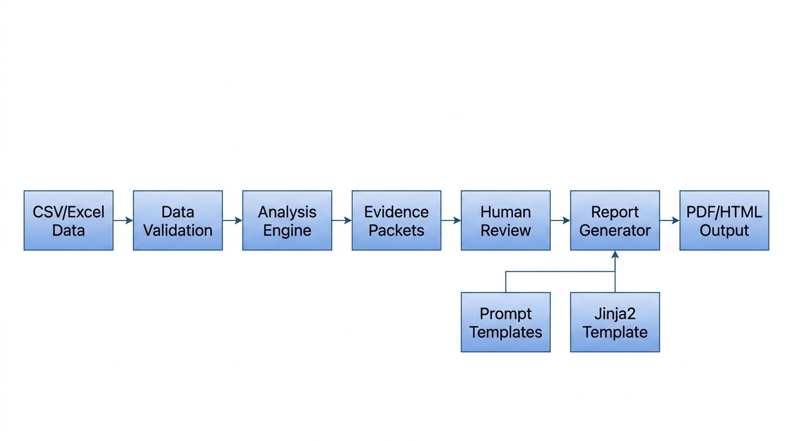

# GenAR – PADER Safety Reporting System

An automated pipeline for generating **Periodic Adverse Drug Experience Reports (PADER)** from Individual Case Safety Report (ICSR) data.

## Overview

GenAR ingests raw ICSR data (CSV or Excel), performs deterministic safety analysis, and produces a structured PADER report in Markdown, HTML, and PDF formats. A human-in-the-loop review step ensures quality control before final report generation.

## Architecture



**Pipeline Flow:**

1. **Data Loading** → Load CSV/Excel ICSR data, normalise column names
2. **Data Validation** → Schema and consistency checks
3. **Analysis** → Compute case counts, demographics, reaction frequencies, seriousness flags
4. **Evidence Packets** → Build section-specific data bundles for each PADER section
5. **Human Review** → Approve or flag each section (skippable with `--non-interactive`)
6. **Report Generation** → Render professional prose from evidence packets
7. **Export** → Output Markdown, convert to PDF/HTML via Pandoc

## Project Structure

```
├── src/
│   ├── main.py                 # Pipeline orchestration (entry point)
│   ├── analysis.py             # Deterministic data analysis
│   ├── data_validation.py      # Schema and consistency checks
│   ├── evidence.py             # Evidence packet builder
│   ├── llm_interface.py        # Report text generation (offline fallback)
│   ├── human_review.py         # Human-in-the-loop approval gate
│   ├── report_generator.py     # Jinja2 template renderer
│   ├── md_to_html.py           # Markdown → HTML converter
│   └── templates/
│       └── report_template.md  # Jinja2 report template
├── prompts/
│   ├── narrative_summary.txt   # Prompt: Narrative Summary section
│   ├── case_summary.txt        # Prompt: Case Summary section
│   ├── reaction_analysis.txt   # Prompt: Reaction Analysis section
│   ├── alerts.txt              # Prompt: Serious Cases / 15-Day Alerts
│   └── trends.txt              # Prompt: Trends and Observations
├── output/                     # Generated reports (after pipeline run)
├── tests/
│   └── test_pipeline.py        # Unit tests
├── sample_data.csv             # Sample ICSR dataset for testing
├── requirements.txt            # Python dependencies
└── README.md                   # This file
```

## Quick Start

### 1. Set up the environment

```powershell
cd "path\to\project"
python -m venv .venv
.\.venv\Scripts\Activate.ps1
pip install -r requirements.txt
```

### 2. Run the pipeline

```powershell
# With human review (interactive)
python src\main.py --data sample_data.csv --out output

# Without human review (auto-approve all sections)
python src\main.py --data sample_data.csv --out output --non-interactive
```

### 3. Convert to PDF (requires Pandoc + MiKTeX)

```powershell
pandoc .\output\pader_report.md -f markdown -t pdf -s -o .\output\pader_report.pdf
```

### 4. Convert to HTML (no LaTeX needed)

```powershell
python src\md_to_html.py
```

## Output Files

| File | Description |
|------|-------------|
| `pader_report.md` | Full PADER report in Markdown |
| `pader_report.pdf` | PDF version (via Pandoc) |
| `pader_report.html` | HTML version (styled, browser-viewable) |
| `case_listing.csv` | Deduplicated case listing |
| `run_log.json` | Execution log with stats and review decisions |

## PADER Report Sections

1. **Reporting Period** — Date range of the reporting window
2. **Narrative Summary and Analysis** — Overall safety profile overview
3. **Summary Analysis of Cases** — Demographics (age, sex, country)
4. **Reaction / Adverse Event Analysis** — Most frequent reactions
5. **Serious Cases / 15-Day Alerts** — Serious case counts and expedited reporting
6. **Trends and Important Observations** — Case volume trends

## Dependencies

- Python 3.10+
- pandas ≥ 2.2.0
- numpy ≥ 1.26.0
- openpyxl ≥ 3.1.5
- Jinja2 ≥ 3.1.4
- Pandoc 3.x (for PDF/HTML conversion)
- MiKTeX (for PDF conversion via LaTeX)

## Future Enhancements

- Connect to a real LLM (Gemini, Claude, GPT) for richer narrative generation
- Add signal detection algorithms
- Support CIOMS-I form export
- Add E2B(R3) XML output for regulatory submission
- Dashboard UI for interactive review

## License

This project was created as part of the GenAI Challenge.
